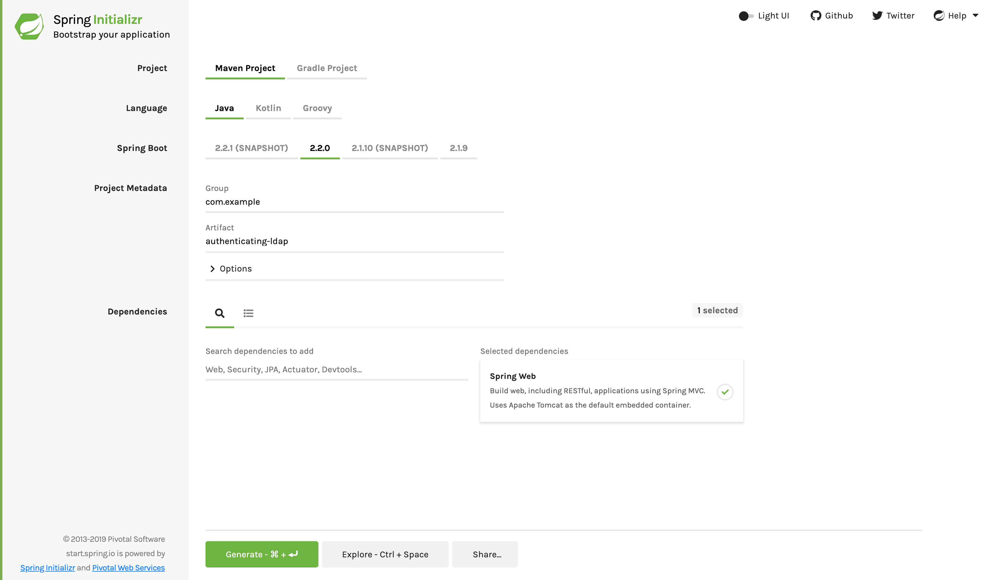

:spring_version: current
:SpringApplication: https://docs.spring.io/spring-boot/docs/{spring_boot_version}/api/org/springframework/boot/SpringApplication.html
:toc:
:icons: font
:source-highlighter: prettify
:project_id: gs-authenticating-ldap

This guide walks you through the process creating an application and securing it with the https://projects.spring.io/spring-security/[Spring Security] LDAP module.

== What You Will build

You will build a simple web application that is secured by Spring Security's embedded Java-based LDAP server. You will load the LDAP server with a data file that contains a set of users.

== What You Need

:java_version: 1.8
include::https://raw.githubusercontent.com/spring-guides/getting-started-macros/master/prereq_editor_jdk_buildtools.adoc[]

include::https://raw.githubusercontent.com/spring-guides/getting-started-macros/master/how_to_complete_this_guide.adoc[]

[[scratch]]
== Starting with Spring Initializr

For all Spring applications, you should start with the https://start.spring.io[Spring
Initializr]. The Initializr offers a fast way to pull in all the dependencies you need for
an application and does a lot of the set up for you. This example needs only the Spring
Web dependency.

NOTE: Because the point of this guide is to secure an unsecured web application, you will
first build an unsecured web application and, later in the guide, add more dependencies
for the Spring Security and LDAP features.

The following image shows the Initializr set up for this sample project:

NOTE: The preceding image shows the Initializr with Maven chosen as the build tool. You
can also use Gradle. It also shows values of `com.example` and
`authenticating-ldap` as the Group and Artifact, respectively. You will use those
values throughout the rest of this sample.

The following listing shows the `pom.xml` file created when you choose Maven:

====
[src,xml]
----
include::initial/pom.xml[]
----
====

The following listing shows the `build.gradle` file created when you choose Gradle:

====
[src,groovy]
----
include::initial/build.gradle[]
----
====

[[initial]]
== Create a Simple Web Controller

In Spring, REST endpoints are Spring MVC controllers. The following Spring MVC controller
(from `src/main/java/com/example/authenticatingldap/HomeController.java`) handles a
`GET /` request by returning a simple message:

====
[source,java,tabsize=2]
----
include::initial/src/main/java/com/example/authenticatingldap/HomeController.java[]
----
====

The entire class is marked up with `@RestController` so that Spring MVC can autodetect the
controller (by using its built-in scanning features) and automatically configure the
necessary web routes.

`@RestController` also tells Spring MVC to write the text directly into the HTTP response
body, because there are no views. Instead, when you visit the page, you get a simple
message in the browser (because the focus of this guide is securing the page with LDAP).

== Build the Unsecured Web Application

Before you secure the web application, you should verify that it works. To do that, you
need to define some key beans, which you can do by creating an `Application` class. The
following listing (from
`src/main/java/com/example/authenticatingldap/AuthenticatingLdapApplication.java`) shows
that class:

====
[source,java,tabsize=2]
----
include::complete/src/main/java/com/example/authenticatingldap/AuthenticatingLdapApplication.java[]
----
====

include::https://raw.githubusercontent.com/spring-guides/getting-started-macros/master/spring-boot-application-new-path.adoc[]

include::https://raw.githubusercontent.com/spring-guides/getting-started-macros/master/build_an_executable_jar_subhead.adoc[]
include::https://raw.githubusercontent.com/spring-guides/getting-started-macros/master/build_an_executable_jar_with_both.adoc[]

If you open your browser and visit http://localhost:8080, you should see the following
plain text:

====
[source,text]
----
Welcome to the home page!
----
====

== Set up Spring Security

To configure Spring Security, you first need to add some extra dependencies to your build.

For a Gradle-based build, add the following dependencies to the `build.gradle` file:

====
[source,java,tabsize=2]
----
include::complete/build.gradle[tag=security,indent=0]
----
====

NOTE: Due to an artifact resolution issue with Gradle, *spring-tx* must be pulled in.
Otherwise, Gradle fetches an older one that doesn't work.

For a Maven-based build, add the following dependencies to the `pom.xml` file:

====
[source,xml]
----
include::complete/pom.xml[tag=security,indent=0]
----
====

These dependencies add Spring Security and UnboundId, an open source LDAP server. With
those dependencies in place, you can then use pure Java to configure your security policy,
as the following example (from
`src/main/java/com/example/authenticatingldap/WebSecurityConfig.java`) shows:

====
[source,java,tabsize=2]
----
include::complete/src/main/java/com/example/authenticatingldap/WebSecurityConfig.java[]
----
====

The `@EnableWebSecurity` annotation turns on a variety of beans that you need to use
Spring Security.

You also need an LDAP server. Spring Boot provides auto-configuration for an embedded
server written in pure Java, which is being used for this guide. The
`ldapAuthentication()` method configures things so that the user name at the login form is
plugged into `{0}` such that it searches `uid={0},ou=people,dc=springframework,dc=org` in
the LDAP server. Also, the `passwordCompare()` method configures the encoder and the name
of the password's attribute.

== Set up User Data

LDAP servers can use LDIF (LDAP Data Interchange Format) files to exchange user data. The
`spring.ldap.embedded.ldif` property inside `application.properties` lets Spring Boot pull
in an LDIF data file. This makes it easy to pre-load demonstration data. The following
listing (from `src/main/resources/test-server.ldif`) shows an LDIF file that works with this example:

====
[source,ldif]
----
include::complete/src/main/resources/test-server.ldif[]
----
====

NOTE: Using an LDIF file is not standard configuration for a production system. However,
it is useful for testing purposes or guides.

:module: secured web application

If you visit the site at http://localhost:8080, you should be redirected to a login page
provided by Spring Security.

Enter a user name of `ben` and a password of `benspassword`. You should see the following
message in your browser:

====
[source,text]
----
Welcome to the home page!
----
====

== Summary

Congratulations! You have written a web application and secured it with
https://docs.spring.io/spring-security/site/docs/current/reference/htmlsingle/[Spring Security].
In this case, you used an
https://docs.spring.io/spring-security/site/docs/current/reference/htmlsingle/#ldap[LDAP-based user store].

== See Also

The following guide may also be helpful:

* https://spring.io/guides/gs/spring-boot/[Building an Application with Spring Boot]

include::https://raw.githubusercontent.com/spring-guides/getting-started-macros/master/footer.adoc[]
